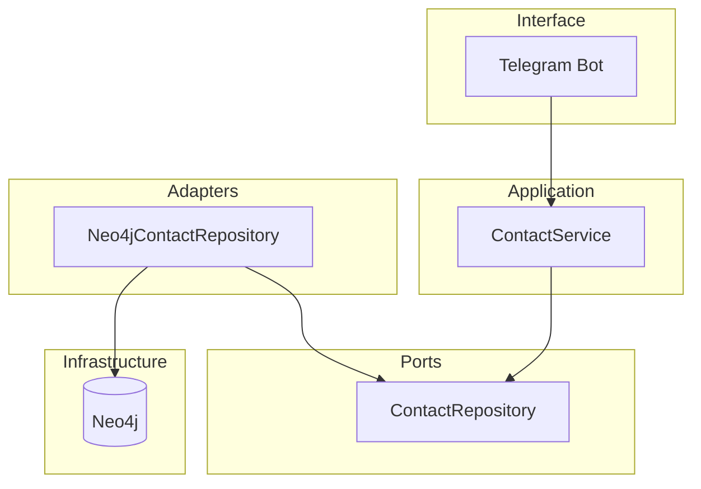

## Constraints from requirements

- **Single-user, Telegram-only:** No REST API, no auth, no multi-tenant logic in MVP.
- **Contact aggregate:** Person + RelationshipContext created atomically; no partial saves.
- **Capabilities:** Add contact (card + context), duplicate detection, list all, search by context (case-insensitive partial). Message-type handling and flow interruption behavior live in the bot.
- **Existing code:** domain.py (Person, RelationshipContext), bimoi/ (ContactService, ContactRepository protocol, in-memory repo, ContactCardData). POC bot in poc/ does not use the core yet.

## High-level architecture

- **Telegram bot** is the only entrypoint: it turns Telegram updates into calls to **ContactService** and maps results back to replies.
- **ContactService** (existing) stays unchanged: it depends only on the **ContactRepository** port (add, get_by_id, list_all, find_duplicate).
- **Neo4jContactRepository** is a new adapter that implements ContactRepository and talks to Neo4j. Domain types (Person, RelationshipContext) remain the same; the adapter maps them to/from the graph.
- **Neo4j** runs in Docker for local dev; the app connects via the official Neo4j Python driver (URI + credentials from env).

No separate "API" or "services" layer for MVP: the bot is the application host and the only consumer of the core.

## Neo4j graph model (MVP, single user)

- **Person** → node label `:Person` (or `:Contact`), properties: `id`, `name`, `phone_number` (optional), `external_id` (optional), `created_at`.
- **RelationshipContext** → node label `:RelationshipContext`, properties: `id`, `description`, `created_at`.
- **Link:** `(Person)-[:HAS_CONTEXT]->(RelationshipContext)` (one-to-one). Creating a contact = create Person node + RelationshipContext node + HAS_CONTEXT edge in one transaction.
- **Duplicate check:** `MATCH (p:Person) WHERE (p.phone_number IS NOT NULL AND p.phone_number = $phone) OR (p.external_id IS NOT NULL AND p.external_id = $external_id) RETURN p` (and load context via the relationship).
- **List all:** Match Person-HAS_CONTEXT->RelationshipContext, order by Person.created_at.
- **Search:** Same match, filter with `toLower(c.description) CONTAINS toLower($keyword)` (or equivalent).

We do not introduce a User node for MVP (all Person nodes belong to the single implicit user). When you add multi-user later, introduce `(:User)-[:KNOWS]->(:Person)` and scope queries by user.

## Module layout

| Layer / module | Responsibility | Depends on |
| --- | --- | --- |
| **domain** | Person, RelationshipContext (value types, validation). | Nothing. |
| **bimoi** (application + port) | ContactCardData and result types; ContactRepository protocol; ContactService; in-memory repo (tests). | domain |
| **bimoi.adapters.persistence** (or **bimoi.persistence**) | Neo4jContactRepository: implements ContactRepository, maps domain <-> graph, uses neo4j driver. | domain, bimoi (port only), neo4j driver |
| **bot** (new) | Telegram bot: build ContactService with Neo4jContactRepository, handle updates (contact, text, /start, /list, /search), map ContactCardData and service results to Telegram. | bimoi (service + ContactCardData), telegram library |
| **Infrastructure** | Docker Compose for Neo4j; env (NEO4J_URI, NEO4J_USER, NEO4J_PASSWORD, TELEGRAM_BOT_TOKEN). | — |

- **poc/** remains unchanged (standalone POC, no dependency on Neo4j or production bot).
- **Tests:** Unit tests for ContactService keep using InMemoryContactRepository. Integration tests (optional later) can spin up Neo4j in Docker and test Neo4jContactRepository.

## Pending-contact state

Today ContactService keeps a single in-memory pending (contact card received, context not yet submitted). Per project context, "Bot restarts mid-flow → In-progress contact creation is lost safely." So for MVP we keep pending in memory in the bot process. If the bot runs as a long-lived process, one pending per process is acceptable for single user. Optionally later: persist pending (e.g. keyed by telegram user id) in Neo4j or a small key-value store so restarts don't lose it; that would be a new port and adapter.

## Docker (development)

- **docker-compose.yml** at repo root (or in a `deploy/` / `docker/` folder): one service, **neo4j**, with image `neo4j:5` (or current LTS), ports 7474 (HTTP) and 7687 (Bolt). Set NEO4J_AUTH in the compose file or via env (e.g. user/password). Optionally mount a volume for data persistence.
- **App (bot)** can run on the host: `python -m bot` (or similar), with env pointing to `NEO4J_URI=bolt://localhost:7687` and the same credentials. Alternatively, add a **bot** service to compose that runs the Python bot and depends on neo4j; both approaches are valid for dev.
- **.env.example** (or docs): NEO4J_URI, NEO4J_USER, NEO4J_PASSWORD, TELEGRAM_BOT_TOKEN so developers know what to set.

## Dependency flow and packaging

- **domain** — no dependencies; can stay at repo root as `domain.py` or become `domain/` if it grows.
- **bimoi** — depends only on domain. Contains application logic and the repository *port*; no Neo4j or Telegram here.
- **bimoi.adapters.persistence** (or a top-level **adapters** package) — depends on bimoi (protocol + domain) and `neo4j` driver. Implements the repository used in production.
- **bot** — depends on bimoi (ContactService, ContactCardData, repository protocol) and `python-telegram-bot`. At startup it instantiates Neo4jContactRepository (with driver from env), injects it into ContactService, and runs the Telegram Application. It does not import domain directly except via bimoi types.

This keeps the core testable without Neo4j and keeps the graph as an implementation detail of the persistence adapter.

## Summary

- **Neo4j:** Single graph for contacts: Person nodes, RelationshipContext nodes, HAS_CONTEXT edges; duplicate by phone/external_id; list and search as Cypher queries. Docker for dev.
- **Modules:** domain (unchanged), bimoi (application + port + in-memory adapter), bimoi.adapters.persistence (Neo4j adapter), bot (Telegram host wiring service + Neo4j repo).
- **No new "services" layer:** ContactService is the application service; the bot is the only interface and calls it directly.
- **Next steps (when you implement):** Add Neo4j adapter implementing ContactRepository, add docker-compose for Neo4j, add the production bot that wires ContactService to Neo4j and handles the full Telegram flow; keep existing tests and POC as-is.
