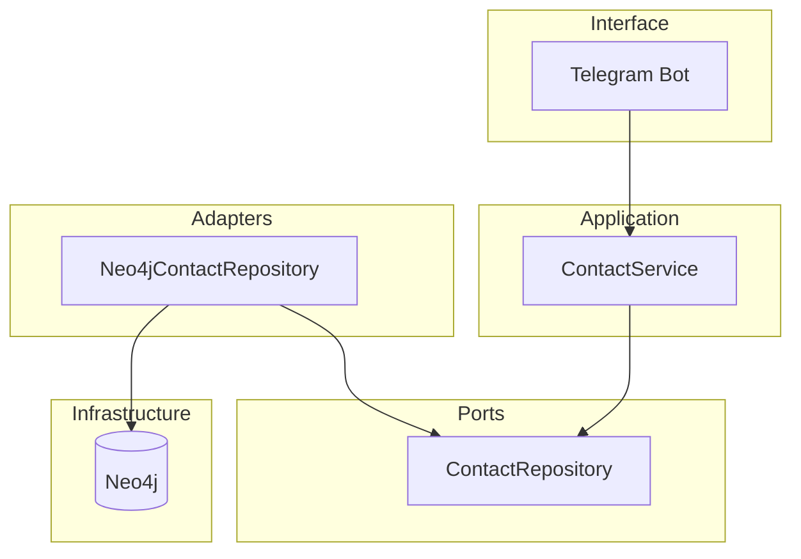

## Constraints from requirements

- **Multi-user, Telegram-first:** REST API included (FastAPI), multi-user with identity layer. Each Telegram user gets isolated contact graph. Authentication handled by Telegram.
- **Contact aggregate:** Person + RelationshipContext created atomically; no partial saves.
- **Capabilities:** Add contact (card + context), duplicate detection, list all, search by context (case-insensitive partial). Message-type handling and flow interruption behavior live in the bot.
- **Existing code:** domain.py (Person, RelationshipContext), bimoi/ (ContactService, ContactRepository protocol, in-memory repo, ContactCardData). POC bot in poc/ does not use the core yet.

## High-level architecture

- **FastAPI backend** provides both REST API and Telegram webhook endpoint. One service handles all clients.
- **Identity layer** (`bimoi.infrastructure.identity`) maps `(channel, external_id)` to stable `user_id` (Account UUID). Each Telegram user gets their own Account.
- **ContactService** depends only on the **ContactRepository** port (add, get_by_id, list_all, find_duplicate, append_context). One service instance per user_id is cached.
- **Neo4jContactRepository** implements ContactRepository and talks to Neo4j. Initialized with a `user_id`, all queries are scoped to that user. Domain types (Person, RelationshipContext) remain the same; the adapter maps them to/from the graph.
- **Neo4j** runs in Docker for local dev; the app connects via the official Neo4j Python driver (URI + credentials from env).

The FastAPI app serves both REST endpoints (`/contacts`, `/contacts/search`) and Telegram webhook (`/webhook/telegram`). All contact data is scoped per user.

## Neo4j graph model (multi-user)

**Identity Layer:**
- **Account** → node label `:Account`, properties: `id` (UUID, the stable user_id), `name`, `bio`, `created_at`.
- **ChannelLink** → node label `:ChannelLink`, properties: `channel` (e.g. "telegram"), `external_id` (e.g. Telegram user ID), `created_at`.
- **Link:** `(ChannelLink)-[:BELONGS_TO]->(Account)`. Each Telegram user maps to one Account; multiple channels can link to the same Account.
- **Constraint:** `(ChannelLink.channel, ChannelLink.external_id)` is unique.

**Contact Data:**
- **Person** → node label `:Person`, properties: `id`, `name`, `phone_number` (optional), `external_id` (optional), `created_at`, `registered` (boolean: true for owner Account, false for contacts).
- **RelationshipContext** → stored as properties on `:KNOWS` relationship: `context_id`, `context_description`, `context_created_at`, `context_updated_at`.
- **Ownership:** `(owner:Person {id: user_id, registered: true})-[:KNOWS {context properties}]->(contact:Person {registered: false})`.
- **Creating a contact:** Create Person node with `registered: false` + KNOWS relationship with context properties from the owner Person to the contact Person.
- **Duplicate check:** Scoped by user_id: `MATCH (owner:Person {id: $user_id, registered: true})-[:KNOWS]->(p:Person) WHERE p.registered = false AND (p.phone_number = $phone OR p.external_id = $external_id)`.
- **List all:** `MATCH (owner:Person {id: $user_id, registered: true})-[k:KNOWS]->(p:Person) WHERE p.registered = false RETURN p, k ORDER BY p.created_at`.
- **Search:** Same match, filter with `toLower(k.context_description) CONTAINS toLower($keyword)`.

## Module layout

| Layer / module | Responsibility | Depends on |
| --- | --- | --- |
| **domain** | Person, RelationshipContext (value types, validation). | Nothing. |
| **bimoi** (application + port) | ContactCardData and result types; ContactRepository protocol; ContactService; in-memory repo (tests). | domain |
| **bimoi.adapters.persistence** (or **bimoi.persistence**) | Neo4jContactRepository: implements ContactRepository, maps domain <-> graph, uses neo4j driver. | domain, bimoi (port only), neo4j driver |
| **bot** (new) | Telegram bot: build ContactService with Neo4jContactRepository, handle updates (contact, text, /start, /list, /search), map ContactCardData and service results to Telegram. | bimoi (service + ContactCardData), telegram library |
| **Infrastructure** | Docker Compose for Neo4j; env (NEO4J_URI, NEO4J_USER, NEO4J_PASSWORD, TELEGRAM_BOT_TOKEN). | — |

- **poc/** remains unchanged (standalone POC, no dependency on Neo4j or production bot).
- **Tests:** Unit tests for ContactService keep using InMemoryContactRepository. Integration tests (optional later) can spin up Neo4j in Docker and test Neo4jContactRepository.

## Pending-contact state

ContactService keeps per-user in-memory pending state (contact card received, context not yet submitted). The FastAPI backend caches one ContactService instance per user_id. File-backed persistence (`.cursor/pending_add_context.json`) is used for add-context flow so pending state survives process restarts. The system is designed so that "Bot restarts mid-flow → In-progress contact creation is lost safely" per project requirements.

## Docker (development)

- **docker-compose.yml** at repo root (or in a `deploy/` / `docker/` folder): one service, **neo4j**, with image `neo4j:5` (or current LTS), ports 7474 (HTTP) and 7687 (Bolt). Set NEO4J_AUTH in the compose file or via env (e.g. user/password). Optionally mount a volume for data persistence.
- **App (bot)** can run on the host: `python -m bot` (or similar), with env pointing to `NEO4J_URI=bolt://localhost:7687` and the same credentials. Alternatively, add a **bot** service to compose that runs the Python bot and depends on neo4j; both approaches are valid for dev.
- **.env.example** (or docs): NEO4J_URI, NEO4J_USER, NEO4J_PASSWORD, TELEGRAM_BOT_TOKEN so developers know what to set.

## Dependency flow and packaging

- **domain** — no dependencies; can stay at repo root as `domain.py` or become `domain/` if it grows.
- **bimoi** — depends only on domain. Contains application logic and the repository *port*; no Neo4j or Telegram here.
- **bimoi.adapters.persistence** (or a top-level **adapters** package) — depends on bimoi (protocol + domain) and `neo4j` driver. Implements the repository used in production.
- **bot** — depends on bimoi (ContactService, ContactCardData, repository protocol) and `python-telegram-bot`. At startup it instantiates Neo4jContactRepository (with driver from env), injects it into ContactService, and runs the Telegram Application. It does not import domain directly except via bimoi types.

This keeps the core testable without Neo4j and keeps the graph as an implementation detail of the persistence adapter.

## Summary

- **Neo4j:** Single graph for contacts: Person nodes, RelationshipContext nodes, HAS_CONTEXT edges; duplicate by phone/external_id; list and search as Cypher queries. Docker for dev.
- **Modules:** domain (unchanged), bimoi (application + port + in-memory adapter), bimoi.adapters.persistence (Neo4j adapter), bot (Telegram host wiring service + Neo4j repo).
- **No new "services" layer:** ContactService is the application service; the bot is the only interface and calls it directly.
- **Next steps (when you implement):** Add Neo4j adapter implementing ContactRepository, add docker-compose for Neo4j, add the production bot that wires ContactService to Neo4j and handles the full Telegram flow; keep existing tests and POC as-is.
